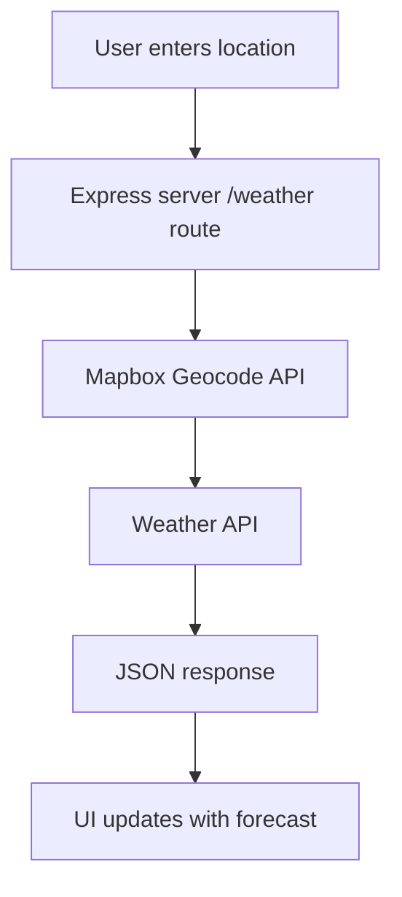

***

# 🌤️ Weather App (Node.js)

A simple **Node.js web app** that lets you check the current weather for any location.  
It takes an address, finds its coordinates using **Mapbox**, and fetches real-time weather data from a third-party API.  

✨ **Key Features**  
- 🚀 Express server with Handlebars templates  
- 🗺️ Mapbox Geocoding + Live Weather API integration  
- 🌐 Browser-based UI + JSON endpoint (`/weather?address=`)  
- ⚡ Quick setup, lightweight, and easy to extend  

***

### 🚀 Requirements
- Node.js v14+  
- npm  

***

### 📦 Setup

```bash
git clone <repo-url>
cd Weather_app-NodeJs
npm install
```

Set up your environment variables (recommended via a `.env` file):  
```env
PORT=3000
MAPBOX_TOKEN=your_mapbox_token
WEATHER_API_KEY=your_weather_key
```

Run the app:  
```bash
npm start       # start in normal mode  
npm run dev     # start with nodemon
```

Open in your browser: [http://localhost:3000](http://localhost:3000/)  

***

### 🌍 Usage

- Visit the web app, enter a location, and get the current forecast instantly!  
- Or use the API directly:  

```bash
curl "http://localhost:3000/weather?address=Berlin"
```

***

### 🔄 Project Flow


***

### 📂 Project Structure

```
public/        # static assets (CSS, client JS)
src/app.js     # Express server
src/utils/     # geocode.js and forecast.js
templates/     # Handlebars views and partials
```

***

### 🤝 Contributing
1. Fork the repository  
2. Create a feature branch (`git checkout -b feature-name`)  
3. Commit changes (`git commit -m "Add new feature"`)  
4. Push and open a Pull Request  

***

### 📄 License
This project is licensed under the **ISC License** (see `package.json`).  

***

### 🙌 Credits
Built with:  
- Node.js  
- Express  
- Handlebars  
- Mapbox Geocoding API  
- Weather API  

***
